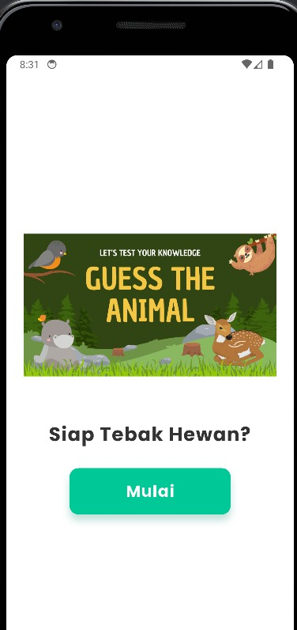
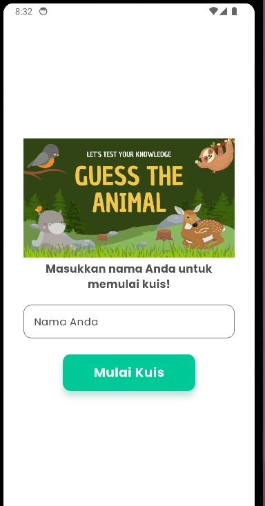
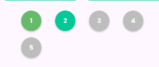
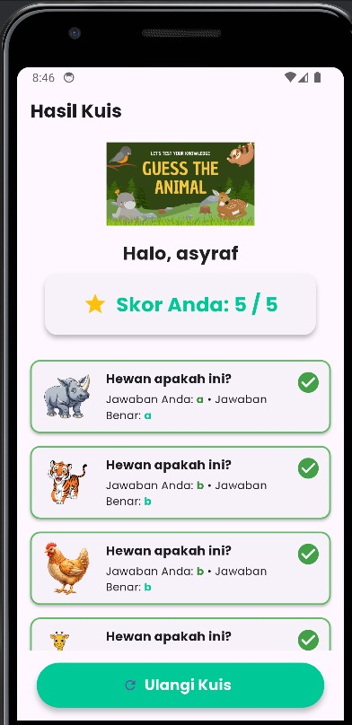

# 👤 UTS Pemrograman Mobile 

**Nama:** Muhammad Asyraf Rizki  
**NIM:** 231401105  
**Lab:** PM 6

---

# 🐾 Animal Quiz

**Animal Quiz** adalah aplikasi kuis edukatif untuk anak-anak yang dibuat dengan **Flutter**.  
Aplikasi ini dirancang agar anak-anak dapat belajar mengenal berbagai jenis hewan melalui permainan tebak gambar yang **menyenangkan dan interaktif**.

## 🐘 Sumber Aset (Credits)

**Logo Aplikasi:**
- [Guess The Animal Game – raket.ph](https://www.raket.ph/cjgbarja/products/guess-the-animal-game?srsltid=AfmBOoqctRS8h-TjwyJjUgLJV1PSvpUfkdGEs-pYWhYKcCCB5pG83Xji)

**Gambar Hewan:**
- 🐘 [Kartun Gajah – PNGTree](https://id.pngtree.com/free-png-vectors/kartun-gajah)
- 🐅 [Kartun Harimau – PNGTree](https://id.pngtree.com/free-png-vectors/kartun-harimau)
- 🦒 [Kartun Jerapah – PNGTree](https://id.pngtree.com/free-png-vectors/kartun-jerapah)
- 🦏 [Kartun Badak – PNGTree](https://id.pngtree.com/free-png-vectors/kartun-badak)
- 🐔 [Kartun Ayam – PNGTree](https://id.pngtree.com/free-png-vectors/kartun-ayam)

**Ikon Flutter yang digunakan:**
- `Icons.refresh`
- `Icons.star`

---

## 🖼️ Tampilan Aplikasi

| No | Tampilan | Deskripsi |
|----|-----------|-|
| 1️⃣ | 🏠 **Halaman Awal** | |
| 2️⃣ | 👤 **Halaman Masukkan Nama** |  |
| 3️⃣ | 🐾 **Halaman Kuis** |  |
| 4️⃣ | 📊 **Halaman Progres** |  |
| 5️⃣ | 🏅 **Halaman Hasil Kuis** |  |

## 🎨 Mockup / Prototype

Desain antarmuka aplikasi dibuat menggunakan **Figma**.  
👉 [https://www.figma.com/design/x8Wp0u4jJ4pXR8rTSFDap9/UTS-Pemob?node-id=0-1&t=PeoCde8O0RUkHaDe-1) 

